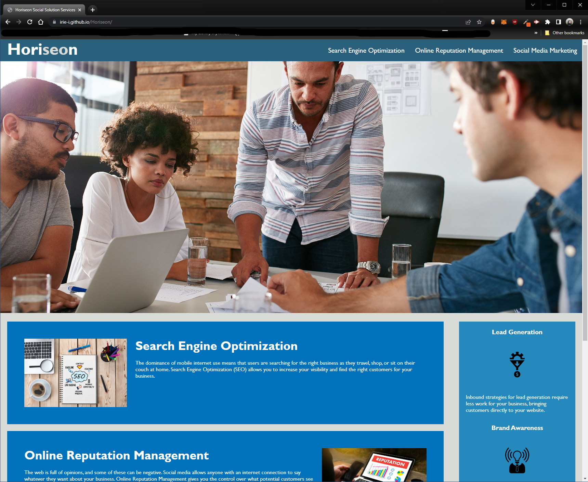

# Horiseon

## Description

This project aims to confirm the understanding of HTML semantics/accessibility. By replacing the provided "div" elements with the proper HTML elements like, "header", "nav", "main", "section", "article", "aside" and "footer"; that tells developers and browsers where the content goes.  This project also emphasizes the practicality of clean code and being able to follow the code without issue. This includes consolidating selectors and properties in CSS by removing redundacies. Also, by ensuring that the CSS selectors and properties are organized and following the semantic structure.

## Screenshot

Enclosed is a screenshot of the current appearence of application after changes to code were made.

## Link

https://irie-i.github.io/Horiseon/

